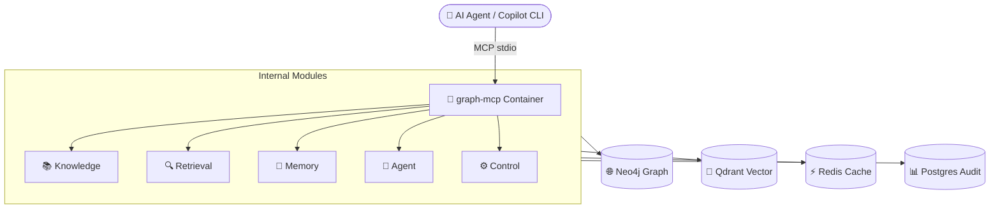

# 🧠 GraphRagMCP v2 — Advanced Code Memory & Agent Platform

<p align="center">
  
  
  
  
</p>

**GraphRagMCP**, büyük kod depolarını (monorepo) anlamak, analiz etmek ve doğal dille sorgulamak için tasarlanmış, **GraphRAG v2** mimarisine sahip gelişmiş bir **Model Context Protocol (MCP)** sunucusudur. 🚀

Geleneksel RAG sistemlerinden farklı olarak kodun yalnızca metin içeriğini değil; **AST (Abstract Syntax Tree)** yapısını, **bağımlılık ilişkilerini**, **semantik graf bağlantılarını** ve **proje mimari özetlerini** kullanarak derin bağlam sunar. 🛠️

---

## 🏗️ Mimari Genel Bakış (V2)

`GraphRagMCP v2`, sistemi 5 temel düzlemde (plane) organize eder:

1.  **📚 Knowledge Plane:** AST indexing, Neo4j graph, summary layers (repo/module summary).
2.  **🧠 Memory Plane:** Episodic, Semantic, Decision ve Temporal memory katmanları.
3.  **🤖 Agent Plane:** Durumlu (stateful) görev orkestrasyonu ve checkpoint sistemi.
4.  **⚡ Execution Plane:** Güvenli sandbox ortamında build/test süreçlerini koşturma.
5.  **⚙️ Control Plane:** Model routing, bütçe yönetimi (guardrail) ve gözlemlenebilirlik (tracer).



---

## ✨ Özellikler

- **🔍 Hibrit Arama:** Vektör (dense) ve anahtar kelime (sparse/BM25) aramalarını RRF ile birleştirir.
- **🌐 Graph-Augmented Retrieval:** Kod bağımlılıklarını ve çağrı zincirlerini kullanarak aramayı genişletir.
- **💾 Episodic Memory:** Sistem, geçmişte çözülen hataları veya alınan mimari kararları "hatırlar".
- **📈 Gelişmiş Etki Analizi:** Bir dosya değiştiğinde, graf üzerinden hangi fonksiyonların etkilenebileceğini hesaplar.
- **🛡️ Güvenli Execution:** Build ve test komutlarını izole edilmiş ortamlarda çalıştırır.
- **💰 Token Budgeting:** LLM maliyetlerini yönetmek için otomatik sıkıştırma ve bütçeleme yapar.

---

## 🔒 Güvenlik (Security)

Bu proje, halka açık depolarda güvenli çalışma prensiplerine göre tasarlanmıştır:

1.  **🕵️ Secret Scanner:** İndeksleme sırasında API anahtarları veya şifreler tespit edilirse otomatik olarak sansürlenir.
2.  **🔑 Environment Variables:** Tüm hassas bilgiler `.env` dosyasında tutulur (git-ignored).
3.  **📂 Path Normalization:** Sistem dosyalarına erişimi engellemek için tüm yollar proje köküne göre kısıtlanır.
4.  **📝 Audit Logs:** Tüm eylemler PostgreSQL üzerinde izlenebilir ve denetlenebilir.

---

## 🚀 Kurulum ve Çalıştırma

### 📋 Ön Koşullar
- Docker ve Docker Compose
- [OpenRouter](https://openrouter.ai/) API Anahtarı

### 1️⃣ Ortam Ayarları
`.env.example` dosyasını kopyalayarak kendi ayarlarınızı yapın:
```bash
cp .env.example .env
# .env dosyasını düzenleyin ve OPENROUTER_API_KEY ekleyin.
```

### 2️⃣ Servisleri Başlat
```bash
docker compose up -d
```

### 3️⃣ MCP Bağlantısı
AI aracınızın yapılandırma dosyasına (`.mcp.json`) aşağıdaki bloğu ekleyin:

```json
{
  "mcpServers": {
    "graph-mcp": {
      "type": "stdio",
      "command": "docker",
      "args": [
        "exec", "-i",
        "-e", "DEFAULT_COLLECTION=my_project",
        "graph-mcp",
        "python", "-m", "src.mcp_server"
      ]
    }
  }
}
```

---

## ⌨️ Scriptler (Komut Satırı Kullanımı)

| Komut | Açıklama |
| :--- | :--- |
| `index.py` | 🔄 Artımlı İndeksleme (Sadece değişen dosyalar) |
| `reindex.py` | 🧹 Tam Yeniden İndeksleme (Sıfırdan) |
| `reindex_v2_auto.py` | 🛠️ V2 Mimari Sıfırlama ve Senkronizasyon |

---

## 📊 Bağlantı Noktaları (UI)
Geliştirme sırasında veritabanlarını izlemek için aşağıdaki arayüzleri kullanabilirsiniz:

*   🌐 **Neo4j Browser:** [http://localhost:7474](http://localhost:7474)
*   🔎 **Qdrant Dashboard:** [http://localhost:6333/dashboard](http://localhost:6333/dashboard)
*   ⚡ **RedisInsight:** [http://localhost:5540](http://localhost:5540)
*   🐘 **pgAdmin:** [http://localhost:5050](http://localhost:5050)

---

## 🤝 Katkıda Bulunma (Contributing)

1.  🍴 Bu depoyu fork edin.
2.  🌿 Yeni bir feature branch oluşturun (`git checkout -b feature/YeniOzellik`).
3.  💾 Değişikliklerinizi commit edin (`git commit -am 'Yeni özellik eklendi'`).
4.  📤 Branch'inizi push edin (`git push origin feature/YeniOzellik`).
5.  🚀 Bir Pull Request oluşturun.

---

## 📄 Lisans

Bu proje [MIT Lisansı](LICENSE) ile lisanslanmıştır.
