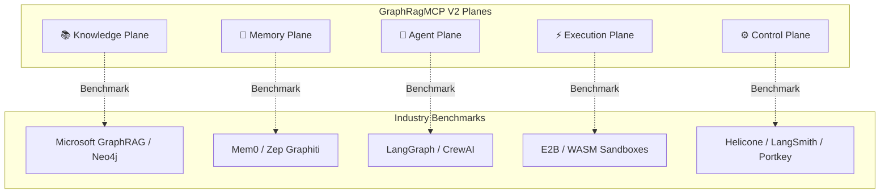

# 📊 GraphRagMCP V2 — SOTA Pazar Araştırması ve Darboğaz Önleme Raporu

Bu rapor; **GraphRagMCP V2** projesinin mimari katmanlarını (Knowledge, Memory, Agent, Execution, Control Planes) küresel pazardaki öncü endüstri standartları (Microsoft GraphRAG, Mem0, Zep, LangGraph, E2B, Helicone, Portkey) ile karşılaştırarak analiz etmek, üretim ortamlarındaki (production) olası darboğazları önlemek ve projeyi daha sürdürülebilir kılmak için teknik stratejiler ve mimari iyileştirme önerileri sunmak amacıyla hazırlanmıştır.

---

## 🗺️ 1. Mimari Katmanların Pazar Karşılaştırması

---

## 📚 KNOWLEDGE PLANE (Bilgi Düzlemi)

### 🔍 Pazar Karşılıkları ve Standartlar
*   **Microsoft GraphRAG:** Ham doküman parçalarından (chunks) LLM yardımıyla entity (varlık), relation (ilişki) ve claim (iddia) çıkartıp, bunları Leiden gibi topluluk tespiti (Community Detection) algoritmalarıyla gruplayarak hiyerarşik özetler oluşturur.
*   **Neo4j GraphRAG:** Vektör benzerlik aramaları (dense retrieval) ile Cypher graf traversal sorgularını (structural retrieval) birleştiren hibrit yaklaşımlara öncülük eder.

### ⚠️ Üretim Ortamındaki (Production) Darboğazlar
1.  **Aşırı Ingestion Gecikmesi ve Maliyeti:** LLM tabanlı varlık/ilişki çıkarımı son derece maliyetlidir ve zaman alır ($O(N)$ LLM çağrısı gerektirir). Büyük kod depolarında (monorepo) bu süreç saatler sürebilir.
2.  **Graf Yoğunluğu Patlaması (Super-node Sorunu):** Bazı merkezi sınıflar veya modüller (örn. `utils`, `config`, `BaseModel`) yüzlerce kenara (edge) sahip olur. Bu durum, graf aramalarında (traversal) LLM bağlam penceresini (context window) gereksiz bilgiyle şişirir ve performansı düşürür.
3.  **Hiyerarşik Özet Kaybı ("Lost in the Middle"):** Leiden topluluklarının ürettiği özetler çok geniş olduğunda, LLM'ler bağlamın ortasındaki spesifik kod detaylarını gözden kaçırabilir (Reasoning Failure).

### 💡 GraphRagMCP V2 İçin SOTA İyileştirme Önerileri

> [!TIP]
> **Hibrit Çıkarım Hattı (Hybrid Extraction Pipeline):** Varlık ve ilişkilerin ilk çıkarımı için doğrudan yüksek maliyetli LLM'ler yerine; spaCy, GLiNER veya daha küçük ölçekli yerel modeller (Llama-3-8B-Instruct) ile **Statik AST Analizini** birleştirin. AST üzerinden sınıflar, metodlar ve import ilişkileri sıfır maliyetle anında çıkarılabilir; LLM sadece bu çıkarımların semantik anlamlarını zenginleştirmek için kullanılmalıdır.

> [!IMPORTANT]
> **Dinamik / Tembel İndeksleme (Lazy Indexing):** Tüm projeyi baştan sona en ince ayrıntısına kadar LLM ile indekslemek yerine; dosya hiyerarşisi ve AST ilişkilerini statik olarak indeksleyip, derin semantik detayları sadece sorgu anında ihtiyaç duyulan bölgeler için **dinamik (lazy)** olarak çıkarın.

---

## 🧠 MEMORY PLANE (Bellek Düzlemi)

### 🔍 Pazar Karşılıkları ve Standartlar
*   **Mem0 (mem0ai):** Çok katmanlı bellek yapısı (Vektör + Graf + Key-Value). Kullanıcı tercihleri, kişiselleştirme ve oturumlar arası (cross-session) kalıcı bilgi tutmaya odaklanır.
*   **Zep (getzep):** **Graphiti** motoru üzerine kurulmuş zaman duyarlı (temporal) bilgi grafları sunar. Gerçeklerin zaman içinde nasıl değiştiğini (örn. kod versiyonları, deprecation süreçleri) takip eder.

### ⚠️ Üretim Ortamındaki (Production) Darboğazlar
1.  **Bellek Sapması (Memory Drift) ve Çelişkili Bilgi:** Zamanla biriken eski ve çelişkili bellekler (örn. *"Kullanıcı X modülünü Go ile yazmak istiyor"*, 2 hafta sonra *"Kullanıcı X modülünü Rust ile yazmaya karar verdi"*). Basit vektör araması her iki bilgiyi de döneceğinden LLM'in kafası karışır.
2.  **Bellek Şişmesi (Context Bloat):** Ajanın her yaptığı ufak adımın belleğe yazılması, bir süre sonra retrieval aşamasında bağlam pencerelerinin gereksiz loglarla dolmasına neden olur.

### 💡 GraphRagMCP V2 İçin SOTA İyileştirme Önerileri

> [!TIP]
> **Zaman Duyarlı Geçerlilik Penceresi (Temporal Decay & Versioning):** Bellek düğümlerine ve ilişkilerine `valid_from` ve `valid_to` zaman damgaları ekleyin. Bir kod yapısı deprecated olduğunda veya karar değiştiğinde, eski kararın ilişkisini Neo4j üzerinde `SUPERSEDES` kenarı ile bağlayıp inaktif işaretleyin.

> [!NOTE]
> **Hiyerarşik Bellek Sıkıştırması (Hierarchical Compaction):** Bellek yazma işlemlerini doğrudan chat akışında senkronize yapmak yerine Redis Pub/Sub üzerinden asenkron bir worker'a devredin. Ham logları önce *Episodic (Oturum bazlı)* özetlere, ardından periyodik olarak rafine edilmiş *Semantic Fact (Kalıcı Gerçekler)* seviyesine sıkıştırın.

---

## 🤖 AGENT PLANE (Ajan Düzlemi)

### 🔍 Pazar Karşılıkları ve Standartlar
*   **LangGraph (LangChain):** Ajan akışlarını durum geçiş grafı (state machine) ve döngüler olarak modeller. Durumlu (stateful) operasyonlar için kalıcı checkpoint veritabanı sunar.
*   **CrewAI / AutoGen:** Çoklu ajanların (multi-agent) hiyerarşik veya koreografik olarak asenkron şekilde yardımlaşarak görevleri tamamlamasını sağlar.

### ⚠️ Üretim Ortamındaki (Production) Darboğazlar
1.  **Sonsuz Kısır Döngüler (Runaway Loops):** Ajanın `Editor ➔ Verifier ➔ Editor` döngüsünde, kod dışı bir hata (örn. port çakışması, eksik ortam değişkeni) nedeniyle sürekli aynı hatayı alıp bütçeyi tüketmesi.
2.  **Durum Kaybı (State Loss):** Uzun süren (saatler alan) ajansal kodlama görevlerinde, container veya sunucu çöktüğünde tüm sürecin sıfırlanması ve en baştan LLM token harcanarak başlanması.

### 💡 GraphRagMCP V2 İçin SOTA İyileştirme Önerileri

> [!TIP]
> **Kalıcı Checkpoint & Geri Alma Mekanizması (State Checkpointing & Rollback):** Ajanın durumunu (State Machine) her adım geçişinde PostgreSQL üzerinde JSONB olarak kaydedin. Bir hata alındığında veya insan müdahalesi gerektiğinde, ajan sürecini kaybetmeden en son kararlı checkpoint'ten **(Resume Task)** devam ettirebilmeli ya da bir adım geri alabilmelidir (Time-travel Debugging).

> [!WARNING]
> **Akıllı Döngü Kırıcı (Heuristic Loop Breaker):** Ajanın ürettiği hata loglarının veya durum vektörlerinin benzerliğini (cosine similarity) takip edin. Eğer ardışık 2 adımda benzerlik %95'in üzerindeyse, limit dolmadan döngüyü kırın ve insan onayına (Approval Gate) yönlendirin.

---

## ⚡ EXECUTION PLANE (Çalıştırma Düzlemi)

### 🔍 Pazar Karşılıkları ve Standartlar
*   **E2B Sandbox (e2b.dev):** Ajanların kod çalıştırabileceği, test koşturabileceği ve terminal süreçlerini yönetebileceği, milisaniyeler seviyesinde ayağa kalkan izole **Firecracker MicroVM** ortamları sağlar.
*   **Docker-in-Docker / WASM Sandboxes:** Ajan kodlarını host makineden tamamen yalıtarak güvenliği garanti eder.

### ⚠️ Üretim Ortamındaki (Production) Darboğazlar
1.  **Yüksek Başlatma Gecikmesi (Cold Start Latency):** Ajanın her derleme/test işlemi için sıfırdan izole Docker ayağa kaldırmak ciddi bir disk ve işlemci yükü oluşturur, ajanın tepki süresini yavaşlatır.
2.  **Sandbox Escape ve Güvenlik Açıkları:** Ajanın shell komut yetkilerinin (`subprocess.run(shell=True)`) kontrolsüz bırakılması durumunda host makinedeki dosyalara erişmesi veya zararlı ağ istekleri yapması.

### 💡 GraphRagMCP V2 İçin SOTA İyileştirme Önerileri

> [!TIP]
> **Ön Isıtmalı Konteyner Havuzu (Pre-warmed Container Pool):** Arka planda hazırda bekleyen, salt-okunur (read-only) mount edilmiş 2-3 adet hafif Docker konteyner havuzu oluşturun. Ajan doğrulama komutu gönderdiğinde cold-start süresini 0ms seviyesine indirin.

> [!IMPORTANT]
> **Gelişmiş Komut Filtreleme Sistemi (AST Command Verification):** Ajanın çalıştıracağı shell komutlarını koşturmadan önce parse edin. Nested `curl | bash` komutlarını, `/etc` gibi kritik dizinlere yazma isteklerini veya izin verilmeyen port erişimlerini statik olarak engelleyen kurallar tanımlayın.

---

## ⚙️ CONTROL PLANE (Kontrol Düzlemi)

### 🔍 Pazar Karşılıkları ve Standartlar
*   **Helicone / LangSmith:** LLM çağrılarını izler, önbelleğe alır (caching), maliyet hesabı yapar ve benchmark setleri toplar.
*   **Portkey / LiteLLM:** Çoklu API sağlayıcıları arasında yük dengeleme (load balancing), dinamik fallback (hata anında alternatif modele geçiş) sunar.

### ⚠️ Üretim Ortamındaki (Production) Darboğazlar
1.  **Senkron Gözlemlenebilirlik Gecikmesi:** Her LLM çağrısının, token sayısının ve audit logunun işlem sırasında senkron olarak Postgres'e yazılması, ajanın toplam işlem süresini artırır.
2.  **API Kesintileri ve Sağlayıcı Bağımlılığı:** Birincil LLM API sağlayıcısı (örn. OpenRouter) çöktüğünde veya rate-limit verdiğinde ajan süreçlerinin yarıda kalması.

### 💡 GraphRagMCP V2 İçin SOTA İyileştirme Önerileri

> [!TIP]
> **Asenkron Audit Streamer (Redis Pub/Sub):** Loglama, maliyet hesabı ve audit trail yazma süreçlerini tamamen asenkron hale getirin. Metrikleri önce Redis memory'ye yazıp, arka planda bir worker vasıtasıyla Postgres'e toplu (bulk) olarak aktarın.

> [!IMPORTANT]
> **Dinamik Fallback Gateway:** OpenRouter servisinin hata vermesi veya yavaşlaması durumunda, sistemin otomatik olarak doğrudan Anthropic veya OpenAI API'lerine yönlenmesini sağlayan bir **failover mekanizması** entegre edin.

---

## 🛠️ GraphRagMCP V2 İçin Darboğaz Önleme ve İyileştirme Yol Haritası

Aşağıdaki matris, bu araştırmanın projedeki sürdürülebilirlik hedeflerine ulaşması için önerilen eylem planını göstermektedir:

| Öncelik | Etkilenen Katman | Önerilen Teknik Çözüm | Pazar İlhamı | Darboğazı Önleme Hedefi |
| :--- | :--- | :--- | :--- | :--- |
| **P0 (Kritik)** | **Knowledge Plane** | AST analizi ile statik ilişkileri çıkar, LLM'i sadece semantik özetleme için kullan. | *Microsoft GraphRAG / Neo4j* | İndeksleme maliyetini **%70**, süresini ise dakikalar seviyesine indirir. |
| **P0 (Kritik)** | **Agent Plane** | PostgreSQL JSONB tabanlı kalıcı Checkpoint yapısı ekle. | *LangGraph* | Sunucu/konteyner çökmelerinde ajan durumunun sıfırlanmasını engeller. |
| **P1 (Yüksek)**| **Memory Plane** | Asenkron Redis sıkıştırma (compaction) worker'ı kur. | *Mem0 / Zep* | Vektör veritabanı şişmesini önler, token maliyetini düşürür. |
| **P1 (Yüksek)**| **Control Plane** | rate-limit veya kesinti anında doğrudan API'ye geçiş (Fallback Router). | *Portkey / LiteLLM* | Sağlayıcı çökmelerinde sistemin çalışmaya devam etmesini sağlar. |
| **P2 (Orta)**  | **Execution Plane**| Ön ısıtmalı Docker konteyner havuzu oluştur. | *E2B Sandboxes* | Test ve derleme sürelerini **%80** hızlandırır. |

---

## 📈 Sonuç

GraphRagMCP V2, modern bir kod anlama ve ajansal yazılım platformunun tüm bileşenlerine sahiptir. Bu rapordaki iyileştirmelerin yapılması, sistemi sadece güçlü bir retrieval sunucusu olmaktan çıkarıp, kurumsal düzeyde (enterprise-ready), milisaniyeler seviyesinde yanıt veren, çökmelere karşı dayanıklı ve maliyet-etkin bir **State-of-the-Art Ajan Platformuna** dönüştürecektir.
